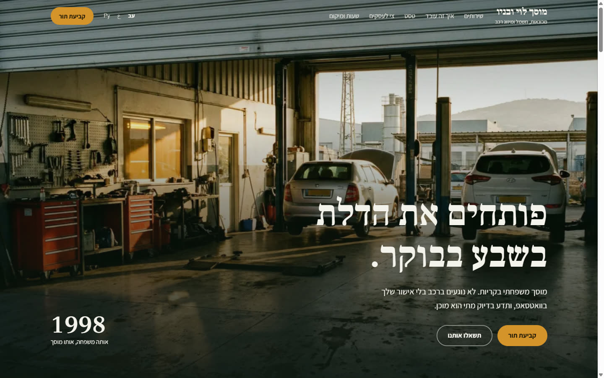
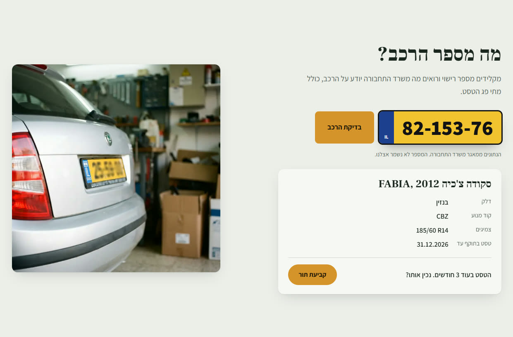
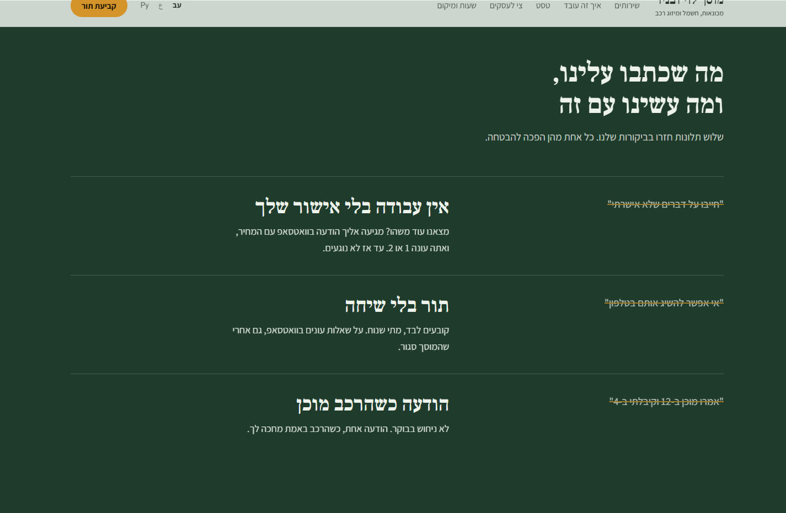
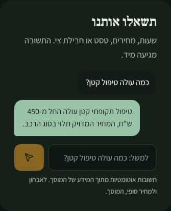

# האתר של מוסך לוי ובניו

> **לבוחנים:** אתר חדש למוסך, במקום אתר Wix מ-2016 שאבי מגדיר "מביך". הוא נבנה בתוך האפליקציה ([levi-garage/](../../levi-garage/)), ומחובר לפתרונות 2 ו-3.
> זה אתר הדגמה: העסק, האנשים והתמונות בדויים, והתמונות נוצרו ב-Gemini (Nano Banana Pro) להמחשה. כך כתוב גם בתחתית האתר, והאתר מסומן כ-noindex.

## המטרה האחת
**קביעת תור עצמית, בלי שיחה.** אבי מקבל 60 עד 80 שיחות ביום, ו-25 מהן הן "מתי הרכב מוכן". האתר לא מסתיר את הטלפון, אלא עונה מראש על הסיבות להתקשר:

| למה מתקשרים | מה האתר עושה במקום |
|---|---|
| לקבוע תור | "קביעת תור" הוא הכפתור הראשי (Cal.com, פתרון 2) |
| "כמה עולה?" | מחירי "החל מ-" מהפרסונה, ו"תשאלו אותנו" |
| שעות, מיקום, חניה | גלויים, עם ניווט ב-Waze |
| "מתי הטסט?" | **בדיקת לוחית:** מקלידים מספר רישוי ומקבלים את פרטי הרכב ממשרד התחבורה, עם קישור לתור שכבר ממולא |
| גרירה ודחוף | הטלפון, גלוי, עם ההקשר "לדחוף בלבד" |

## מה מיוחד
1. **בדיקת לוחית חיה** מול המאגר הציבורי של משרד התחבורה (data.gov.il). המספר עובר דרך השרת שלנו ולא נשמר.
2. **"תשאלו אותנו"**, החלופה ל-ChatBase: עוזר מידע שעונה רק מתוך [בסיס ידע סגור](../../levi-garage/lib/site/knowledge.ts), עם Gemini דרך Vertex AI. **מוח אחד, שני ערוצים:** אותו בסיס ידע ישמש את בוט הוואטסאפ (פתרון 3).
   - **בנייה מול קנייה:** ChatBase עולה כ-40$ בחודש. כאן העלות היא כמה שקלים בחודש של Gemini מהקרדיט, והידע והשיחות נשארים אצל המוסך.
3. **שלוש שפות:** עברית (ברירת מחדל), ערבית ורוסית, כל אחת עם גופנים שתומכים בכתב שלה. הקהל בקריות מגוון, וגם הצוות מדבר את שלוש השפות.
4. **"מה שכתבו עלינו, ומה עשינו עם זה":** שלוש התלונות מגוגל שבפרסונה הפכו לשלוש הבטחות, וכל אחת מהן מתממשת בפתרון אמיתי: אישור תיקון בוואטסאפ (פתרון 4), תור בלי שיחה (פתרון 2), והודעה כשהרכב מוכן (פתרון 3).
5. **עמודי חובה:** [מדיניות פרטיות](../../levi-garage/app/(he)/privacy/page.tsx), שמתארת בדיוק איך המערכות שבנינו מטפלות במידע (לפי תיקון 13), וזה הקישור שהיה חסר בטופס של Cal.com. בנוסף [הצהרת נגישות](../../levi-garage/app/(he)/accessibility/page.tsx) לפי ת"י 5568 ברמה AA, ותנאי שימוש.

## איך הוא נבנה (התהליך)
נבנה עם הסקיל `site`, בשישה שלבים: ראיון, קריאת עיצוב, תוכן, **שלושה כיווני עיצוב אמיתיים לבחירה**, בנייה ושער איכות.
- **שלושת הכיוונים:** "לוחית", "שלושה דורות" ו"אישור בוואטסאפ". כל אחד מהם הוא דף HTML אמיתי ([design/directions/](../../levi-garage/design/directions/)).
- **הבחירה:** "שלושה דורות" לפתיחה ולסגנון, ו"לוחית" כחלק השני. הנימוק: קודם אמון, אחר כך פעולה.
- **המסמכים:** [brief.md](../../levi-garage/design/brief.md) · [PRODUCT.md](../../levi-garage/PRODUCT.md) · [DESIGN.md](../../levi-garage/DESIGN.md) · [chosen.md](../../levi-garage/design/directions/chosen.md) · [שער האיכות](../../levi-garage/design/reports/gate.md)

## בדיקות (22.9.2026)
- **תצוגה:** 3 שפות × 3 רוחבי מסך, בלי גלישה. מצב בהיר וכהה.
- **נגישות:** ניגודיות AA בכל 12 זוגות הצבעים (הנמוך 6.08:1), מבנה כותרות ואזורים תקין, ומטרות מגע של 44px.
- **"תשאלו אותנו":** 6 שאלות, כולל ניסיון עקיפה שנכשל. פירוט מלא ב-[gate.md](../../levi-garage/design/reports/gate.md).

## צילומי מסך
| | |
|---|---|
|  |  |
|  |  |

## מה פתוח
- **וואטסאפ:** יחובר אחרי שנתקן את הניתוב בעוזר האישי, כדי שבוחן שכותב לא יגיע לעוזר הפרטי.
- **פריסה ל-Vercel:** מחכה לשלב הבא.
- **אזור הצוות** ("כניסת צוות" בתחתית): פתרון 4.
